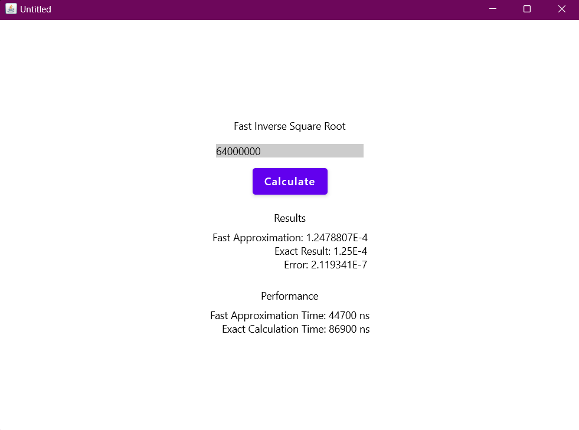

# Fast Inverse Square Root Algorithm

## Description

This is a simple application that demonstrates the fast inverse square root algorithm. The algorithm is used to calculate the inverse square root of a floating point number. The algorithm is used in computer graphics to calculate the normal vector of a surface. The algorithm is used in the Quake III Arena game.

## Install

Clone the repository and using IntelliJ IDEA open the project. The project uses Java 17.

## Run

Run the `Main` class.



## Usage

Enter a floating point number and press the `Calculate` button.

## Algorithm

```java
float x2 = number * 0.5F;
float y = number;
int i = Float.floatToRawIntBits(y);
i = 0x5f3759df - (i >> 1);
y = Float.intBitsToFloat(i);
y = y * (1.5F - (x2 * y * y));
return y;
```
